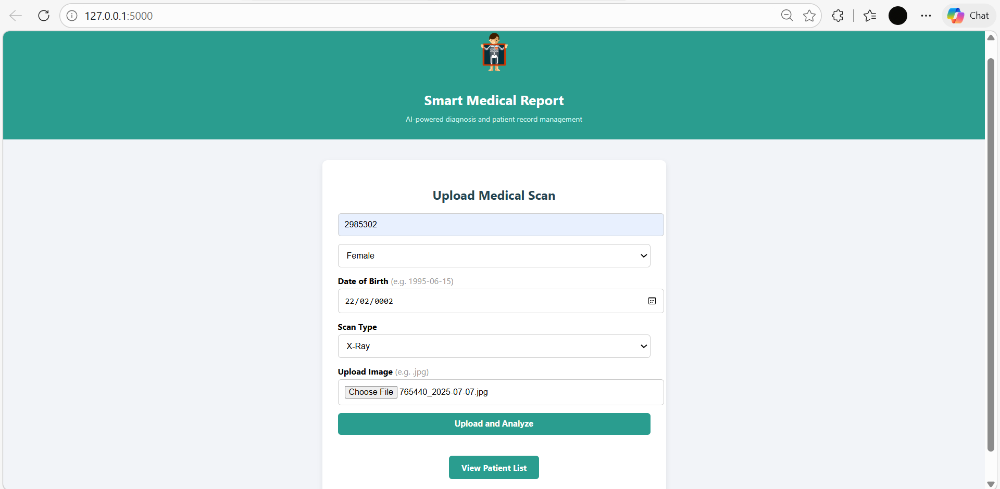
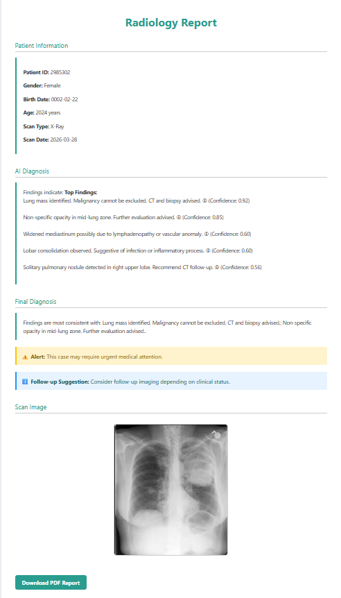
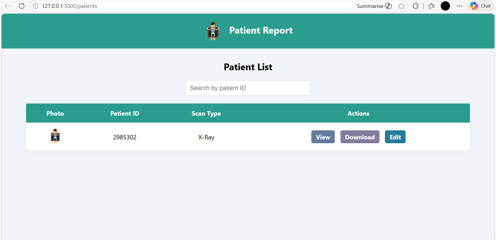
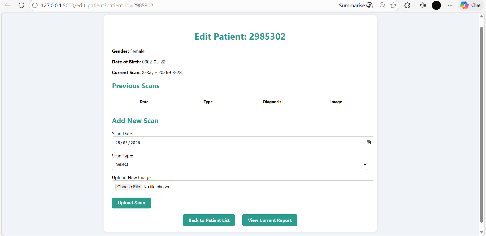
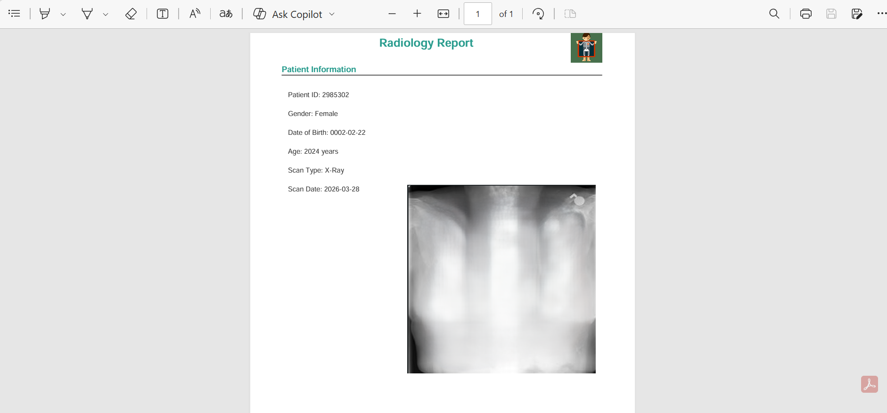

# 🩺 Smart Medical Report System

An intelligent radiology reporting system that analyzes X‑ray images using deep learning, generates structured medical reports, and manages patient scan history through a clean and modern interface.

---

## 🚀 Overview

This system automates the radiology workflow by combining:
- AI‑powered X‑ray analysis  
- Dynamic report generation  
- Patient record management  
- PDF export  
- MongoDB storage  

It is designed for research, prototyping, and educational use in medical imaging and AI.


---

## ⚠️ Disclaimer

This system is a **simulation/prototype for research and educational purposes only**.  
It is **NOT a certified medical device**, and the AI predictions **must not** be used as a substitute for professional medical diagnosis.  
All findings generated by the system should be **reviewed, validated, and interpreted by a licensed medical doctor** before making any clinical decisions.

---

## 🧠 Key Features

### 🔍 Automated X‑ray Analysis
- TorchXRayVision DenseNet121 model  
- Top pathology predictions with confidence scores  
- Clinical and patient‑friendly explanations  

### 📝 Smart Report Generation
- Initial diagnosis  
- Final summarized diagnosis  
- Critical alerts  
- Follow‑up recommendations  
- PDF export  

### 👤 Patient Management
- Add new patients  
- Upload scans  
- Edit patient info  
- Track previous scans with thumbnails  

### 🖼️ Image Handling
- Secure upload system  
- Preprocessing for model inference  
- Organized storage in `/uploads`  

### 🗄️ Database
MongoDB stores:
- Patient demographics  
- Scan metadata  
- Findings & diagnosis  
- Image paths  
- Scan history  

---

## 📂 Project Structure

```
Smart_Medical_Report_System/
│
├── app/
│   └── MedicalReport.py
│
├── templates/
│   ├── home.html
│   ├── patients.html
│   ├── edit_patient.html
│   └── report.html
│
├── static/
│   ├── logo.png
│   └── patient_icon.png
│
├── uploads/
│
├── run.py
├── requirements.txt
└── README.md
```

---

## ⚙️ Installation

### 1. Clone the repository
```bash
git clone https://github.com/Eitharba/Smart-Medical-Report-System.git
cd Smart-Medical-Report-System
```

### 2. Install dependencies
```bash
pip install -r requirements.txt
```

### 3. Start MongoDB
Ensure MongoDB is running locally:
```
mongodb://localhost:27017/
```

### 4. Run the application
```bash
python run.py
```

### 5. Open in browser
```
http://127.0.0.1:5000/
```

---

## 🧪 Model Information

- Model: DenseNet121 (TorchXRayVision)  
- Trained on: NIH, CheXpert, MIMIC‑CXR  
- Predicts: 18+ thoracic pathologies  

---

## 📸 Screenshots

### Home Page


### Report Page


### Patient List


### Edit Patient


### PDF Sample


---

## 📌 Future Enhancements

- Add CT & MRI deep learning models  
- User authentication  
- Cloud deployment  

---

## 👩‍⚕️ Author

**Eithar**  
AI Engineer  

---

## ⭐ Support

If you find this project useful, consider giving it a ⭐ on GitHub.
